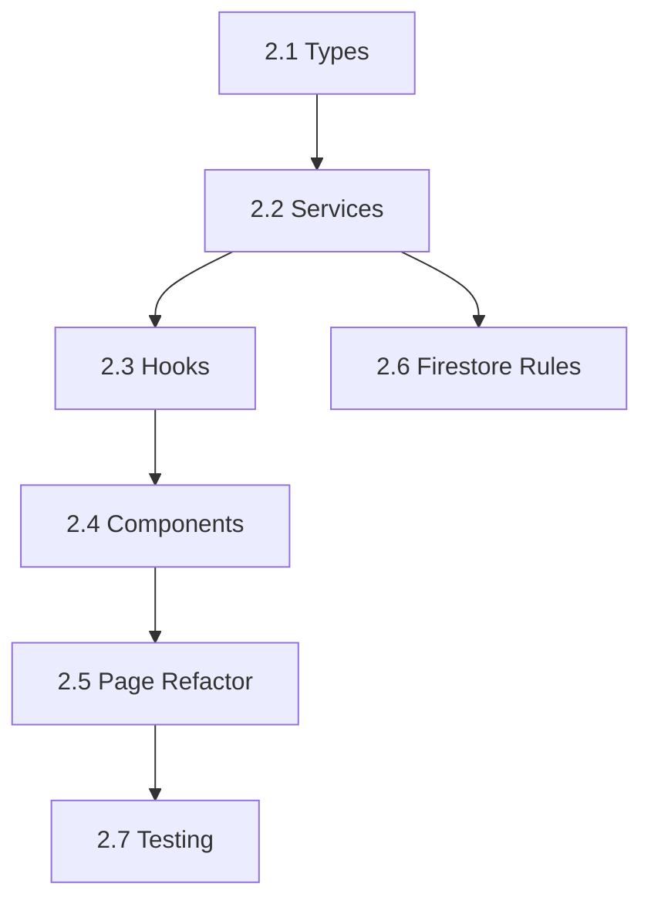

# Phase 2: 360° Board - Complete Implementation Plan

## Executive Summary

This plan transforms the current mock dashboard into a fully-functional 360° Board featuring real-time KPI aggregation, interactive risk mapping, trend visualization, and live alert feeds. The implementation follows the PRD specifications and integrates with existing Firebase infrastructure.---

## Phase 2.1: Foundation & Type Definitions

### Task 2.1.1: Extend Dashboard Types

**File:** [`src/types/dashboard.ts`](src/types/dashboard.ts)Add comprehensive type definitions:

```typescript
// Risk Map Types
export interface RiskMapCell {
  likelihood: 1 | 2 | 3 | 4 | 5;
  severity: 1 | 2 | 3 | 4 | 5;
  count: number;
  risks: RiskReference[];
}

export interface RiskReference {
  id: string;
  title: string;
  category: HazardCategory;
  departmentId?: string;
}

// Extended KPI Types
export interface DashboardKPI {
  id: string;
  category: 'lead' | 'lag';
  name: string;
  value: number;
  unit: string;
  target?: number;
  threshold: { warning: number; critical: number };
  trend: TrendData;
  sparklineData: number[];
  status: 'good' | 'warning' | 'critical';
  lastUpdated: Timestamp;
}

export interface TrendData {
  direction: 'up' | 'down' | 'stable';
  percentage: number;
  period: 'day' | 'week' | 'month';
}

// Alert Feed Types
export interface DashboardAlert {
  id: string;
  type: 'incident' | 'capa' | 'compliance' | 'training' | 'health' | 'system';
  priority: 'low' | 'medium' | 'high' | 'critical';
  title: string;
  description: string;
  actionRequired: boolean;
  actionUrl?: string;
  createdAt: Timestamp;
  readBy: string[];
  dismissedBy: string[];
}

// Aggregated Metrics
export interface DashboardMetrics {
  organizationId: string;
  calculatedAt: Timestamp;
  kpis: DashboardKPI[];
  riskMatrix: RiskMapCell[][];
  alertsSummary: {
    total: number;
    unread: number;
    critical: number;
  };
}
```

---

## Phase 2.2: Backend Services & Cloud Functions

### Task 2.2.1: Create Dashboard Service

**File:** `src/services/dashboardService.ts`Implement Firestore operations for:

- Fetching aggregated KPI data
- Real-time alert subscriptions
- Risk map data retrieval
- Trend data queries

**Key Functions:**

```typescript
- getDashboardMetrics(orgId: string): Promise<DashboardMetrics>
- subscribeToAlerts(orgId: string, callback): Unsubscribe
- getRiskMapData(orgId: string): Promise<RiskMapCell[][]>
- getTrendData(orgId: string, kpiId: string, period): Promise<TrendPoint[]>
- markAlertAsRead(alertId: string, userId: string): Promise<void>
- dismissAlert(alertId: string, userId: string): Promise<void>
```


### Task 2.2.2: Create KPI Aggregation Service

**File:** `src/services/kpiService.ts`Implement KPI calculation logic (client-side for MVP, Cloud Functions for production):**KPIs to Calculate (per PRD/UI-UX Guide):**| KPI | Type | Formula ||-----|------|---------|| Taux de fréquence (TF) | Lag | (Accidents × 1,000,000) / Hours worked || Taux de gravité (TG) | Lag | (Days lost × 1,000) / Hours worked || Taux d'incidents | Lag | Incidents / Employees || Taux de conformité | Lag | Compliant items / Total items || Taux de clôture CAPA | Lead | Closed CAPAs / Total CAPAs || Taux de formation | Lead | Completed trainings / Planned trainings || Jours sans accident | Lead | Days since last LTI || Near-miss ratio | Lead | Near-misses / Total incidents |

### Task 2.2.3: Cloud Functions for Aggregation (Optional/Production)

**Directory:** `functions/src/dashboard/`

- `aggregateKPIs.ts` - Scheduled function (daily) for KPI calculation
- `updateAlerts.ts` - Triggered function when incidents/CAPAs are created
- `recalculateRiskMap.ts` - Triggered when risk assessments change

---

## Phase 2.3: React Query Hooks

### Task 2.3.1: Create Dashboard Hooks

**File:** `src/hooks/useDashboard.ts`

```typescript
// Main hooks
export function useDashboardMetrics(orgId: string)
export function useKPIs(orgId: string)
export function useRiskMap(orgId: string)
export function useTrendData(kpiId: string, period: string)
export function useAlerts(orgId: string, options?: AlertOptions)
export function useRecentActivity(orgId: string, limit?: number)

// Mutations
export function useMarkAlertRead()
export function useDismissAlert()
export function useRefreshKPIs()
```

**Implementation Pattern:**

- Use `@tanstack/react-query` for server state management
- Implement optimistic updates for alert actions
- Use Firestore `onSnapshot` for real-time alert feed
- Cache KPIs with 5-minute stale time

---

## Phase 2.4: UI Components

### Task 2.4.1: KPI Banner Component

**File:** `src/components/dashboard/KPIBanner.tsx`Features:

- Responsive grid of KPI cards (5 columns desktop, 2 mobile)
- Visual indicators: icons, colors, trend arrows
- Sparkline mini-charts using Recharts
- Click to drill-down to detailed analytics
- Skeleton loading states

**Design (per UI-UX Guide):**

- Lead indicators: Blue/teal theme (proactive)
- Lag indicators: Orange/red theme (reactive)
- Status colors: Green (good), Yellow (warning), Red (critical)

### Task 2.4.2: Risk Map Component

**File:** `src/components/dashboard/RiskMap.tsx`Features:

- 5×5 interactive heatmap grid
- Color gradient: Green → Yellow → Orange → Red
- Hover tooltips showing risk details
- Click to filter risks by cell
- Toggle between "Initial" and "Residual" risk views

**Implementation:**

- CSS Grid for layout
- Dynamic cell colors based on count
- Radix UI Tooltip for hover info
- Animation on data changes

### Task 2.4.3: Trend Charts Component

**File:** `src/components/dashboard/TrendCharts.tsx`Features:

- Multi-series line chart for KPI trends
- Time period selector: 7d, 30d, 90d, 1y
- Reference lines for targets/thresholds
- Responsive sizing
- Export capability (PNG/CSV)

**Implementation:**

- Recharts `LineChart` with `ResponsiveContainer`
- ChartContainer from `src/components/ui/chart.tsx`
- Custom tooltip with French formatting

### Task 2.4.4: Alert Feed Component

**File:** `src/components/dashboard/AlertFeed.tsx`Features:

- Real-time updates via Firestore listener
- Priority-based visual indicators
- Unread badge counter
- Mark as read / Dismiss actions
- Filter by type/priority
- "Show more" pagination
- Empty state

**Alert Types (per PRD):**

- 🔴 New incident reported
- 🟡 CAPA approaching deadline
- 🟢 Training completed
- 🔵 Compliance review due
- ⚪ System notifications

### Task 2.4.5: Quick Actions Component

**File:** `src/components/dashboard/QuickActions.tsx`Actions (per PRD):

- Déclarer un incident
- Créer une action CAPA
- Planifier une formation
- Lancer un audit
- Générer un rapport

Implementation: Responsive button grid with icons, keyboard shortcuts

### Task 2.4.6: AI Insights Panel

**File:** `src/components/dashboard/AIInsightsPanel.tsx`Features:

- AI-generated recommendations
- Confidence scores
- "Accept" / "Dismiss" actions
- Link to source data

---

## Phase 2.5: Dashboard Page Refactor

### Task 2.5.1: Refactor DashboardPage

**File:** [`src/pages/dashboard/DashboardPage.tsx`](src/pages/dashboard/DashboardPage.tsx)Replace mock data with real data integration:

```tsx
// Layout structure
<DashboardContainer>
  <DashboardHeader />
  <KPIBanner kpis={kpis} loading={isLoading} />
  
  <DashboardGrid>
    <MainContent>
      <RiskMap data={riskMapData} />
      <TrendCharts data={trendData} />
    </MainContent>
    
    <Sidebar>
      <AlertFeed alerts={alerts} />
      <AIInsightsPanel recommendations={aiRecs} />
    </Sidebar>
  </DashboardGrid>
  
  <QuickActions />
</DashboardContainer>
```


### Task 2.5.2: Dashboard Layout Component

**File:** `src/components/dashboard/DashboardLayout.tsx`Responsive grid layout:

- Desktop: 3-column layout (main 2/3, sidebar 1/3)
- Tablet: 2-column layout
- Mobile: Single column, stacked

---

## Phase 2.6: Firestore Collections & Security

### Task 2.6.1: Create Firestore Collections

**Collections:**

```javascript
/organizations/{orgId}/dashboardMetrics/{metricsId}
/organizations/{orgId}/alerts/{alertId}
/organizations/{orgId}/kpiHistory/{date}
```


### Task 2.6.2: Update Firestore Rules

**File:** [`firestore.rules`](firestore.rules)Add rules for dashboard collections:

```javascript
match /organizations/{orgId}/dashboardMetrics/{metricsId} {
  allow read: if isOrgMember(orgId);
  allow write: if false; // Only Cloud Functions write
}

match /organizations/{orgId}/alerts/{alertId} {
  allow read: if isOrgMember(orgId);
  allow update: if isOrgMember(orgId) && 
    request.resource.data.diff(resource.data).affectedKeys()
      .hasOnly(['readBy', 'dismissedBy']);
}
```

---

## Phase 2.7: Testing & Polish

### Task 2.7.1: Component Testing

- Unit tests for KPI calculations
- Component tests for all dashboard components
- Integration tests for data flow

### Task 2.7.2: Seed Data Script

**File:** `scripts/seedDashboardData.ts`Create realistic demo data for:

- 10+ incidents with varying severities
- 15+ CAPAs in different states
- 50+ risk assessments
- Alert history

### Task 2.7.3: Performance Optimization

- Implement React.memo for expensive components
- Use virtualization for long alert lists
- Add query result caching
- Lazy load trend charts

---

## Implementation Order & Dependencies



---

## File Structure Summary

```javascript
src/
├── types/
│   └── dashboard.ts          # Extended types
├── services/
│   ├── dashboardService.ts   # Firestore operations
│   └── kpiService.ts         # KPI calculations
├── hooks/
│   └── useDashboard.ts       # React Query hooks
├── components/
│   └── dashboard/
│       ├── KPIBanner.tsx
│       ├── KPICard.tsx
│       ├── RiskMap.tsx
│       ├── RiskMapCell.tsx
│       ├── TrendCharts.tsx
│       ├── AlertFeed.tsx
│       ├── AlertItem.tsx
│       ├── QuickActions.tsx
│       ├── AIInsightsPanel.tsx
│       └── DashboardLayout.tsx
└── pages/
    └── dashboard/
        └── DashboardPage.tsx  # Refactored
```

---

## Branch Strategy (per `.cursorrules`)

1. Create task in Notion: "SAH-XX: Implement 360° Board"
2. Branch: `feature/SAH-XX-360-board`
3. Commits: `SAH-XX: Add dashboard types`, etc.
4. PR: `SAH-XX: Implement Phase 2 - 360° Board`

---

## Estimated Effort