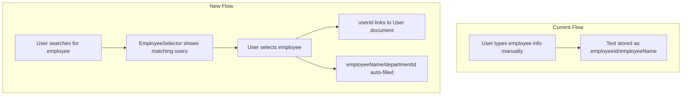

# Healthmeter Employee Selector Refactoring

## Problem Statement

Currently, when creating fiches medicales, visites, and expositions, users manually type employee information (ID, name, department). This leads to:

- Data inconsistency (typos, naming variations)
- No link to actual user accounts
- No validation that the employee exists

## Solution Overview

Replace manual text inputs with a searchable autocomplete selector that fetches existing users from the organization database.---

## Architecture



---

## Phase 1: Create EmployeeSelector Component

Create a new reusable component at [`src/components/health/EmployeeSelector.tsx`](src/components/health/EmployeeSelector.tsx):**Features:**

- Searchable dropdown using the existing `Command` component
- Debounced search calling `searchUsers()` from [`src/services/userService.ts`](src/services/userService.ts)
- Shows user avatar, name, email, and department
- Returns full User object on selection
- Loading and empty states
- Optional filtering by department

**Dependencies:**

- Uses `searchUsers()` function already in userService.ts (line 489-516)
- Uses Command components from [`src/components/ui/command.tsx`](src/components/ui/command.tsx)
- Uses Popover for dropdown positioning

---

## Phase 2: Update Type Definitions

### No Schema Changes Required

The current types are already flexible enough. We will:

- Keep `employeeId: string` - will store User document ID (uid)
- Keep `employeeName: string` - will be auto-filled from `user.displayName`
- Keep `departmentId: string` - will be auto-filled from `user.departmentId`

The key difference is that `employeeId` will now be a valid User document reference instead of arbitrary text.

### Optional Enhancement

Consider adding a comment in [`src/types/health.ts`](src/types/health.ts) to clarify that `employeeId` references a User document.---

## Phase 3: Update Forms

### 3.1 MedicalRecordForm.tsx

File: [`src/components/health/MedicalRecordForm.tsx`](src/components/health/MedicalRecordForm.tsx)**Changes:**

- Replace the manual inputs for employeeId/employeeName (lines 477-500) with EmployeeSelector
- Auto-fill departmentId and jobTitle from selected user when available
- When editing, show the pre-selected employee
- Disable employee selector in edit mode (cannot reassign a medical record)

### 3.2 VisitForm.tsx

File: [`src/components/health/VisitForm.tsx`](src/components/health/VisitForm.tsx)**Changes:**

- Replace manual inputs (lines 153-175, 178-201) with EmployeeSelector
- Auto-fill departmentId/departmentName from selected user
- Keep department fields read-only after selection

### 3.3 Individual Exposures in MedicalRecordForm

The exposure section in MedicalRecordForm (Step 5, lines 891-1008) creates exposures linked to a single employee. This is already handled by the parent medical record selection.

### 3.4 OrganizationExposure Multi-Employee Selector

Currently, `OrganizationExposure` in [`src/types/health.ts`](src/types/health.ts) (line 560-562) has:

```typescript
exposedEmployeeCount: number;
exposedEmployeeIds: string[];
```

**Changes needed:**

- Create a multi-select variant: `EmployeesMultiSelector`
- Find/create the form for OrganizationExposure (currently no dedicated form exists)
- The ExposureTable has an `onCreateExposure` prop but no form component

---

## Phase 4: Create Hook for Employee Search

Create [`src/hooks/useEmployeeSearch.ts`](src/hooks/useEmployeeSearch.ts):

- Wraps `searchUsers()` with React Query
- Handles debouncing
- Provides loading/error states
- Caches results for performance

---

## File Changes Summary

| File | Action ||------|--------|| `src/components/health/EmployeeSelector.tsx` | CREATE - Main searchable selector || `src/components/health/EmployeesMultiSelector.tsx` | CREATE - Multi-select variant || `src/hooks/useEmployeeSearch.ts` | CREATE - Hook for search logic || `src/components/health/MedicalRecordForm.tsx` | MODIFY - Replace text inputs || `src/components/health/VisitForm.tsx` | MODIFY - Replace text inputs || `src/types/health.ts` | MODIFY - Add clarifying comments || `src/components/health/ExposureForm.tsx` | CREATE - New form for OrganizationExposure |---

## Testing Points

- Create a new fiche medicale and verify employee search works