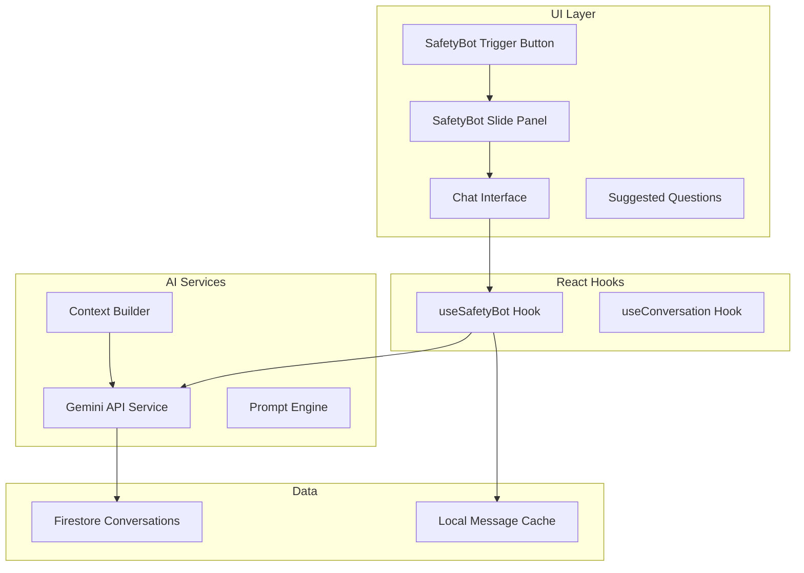

# Phase 6: SafetyBot & Polish Implementation Plan

This plan covers the implementation of SafetyBot (global AI assistant), PDF report generation, optional modules UI, and platform polish for weeks 17-18.---

## 1. SafetyBot - Global AI Chat Interface

### Architecture




### Implementation Files

| File | Purpose ||------|---------|| `src/config/gemini.ts` | Gemini API client initialization || `src/services/aiService.ts` | AI service layer for Gemini calls || `src/components/safetybot/SafetyBot.tsx` | Main chat panel component || `src/components/safetybot/SafetyBotTrigger.tsx` | Floating trigger button || `src/components/safetybot/ChatMessage.tsx` | Message bubble component || `src/components/safetybot/SuggestedActions.tsx` | Quick action buttons || `src/hooks/useSafetyBot.ts` | SafetyBot state and API hook || `src/prompts/safetyBotPrompt.ts` | System prompt templates || `src/types/ai.ts` | AI-related type definitions |

### Key Features

- **Global Accessibility**: Fixed sidebar/floating button visible on all authenticated pages
- **Context-Aware**: Knows current page, user role, and organization data
- **Multi-Module**: Can answer about any SAHTEE module (CAPA, Compliance, Health, etc.)
- **Suggested Questions**: Dynamic suggestions based on current context
- **Action Navigation**: Can link to specific pages/actions within the platform
- **Conversation History**: Persisted in Firestore per user

### Gemini Integration

```typescript
// src/config/gemini.ts - New file
import { GoogleGenerativeAI } from '@google/generative-ai';

const genAI = new GoogleGenerativeAI(import.meta.env.VITE_GEMINI_API_KEY);

export const safetyBotModel = genAI.getGenerativeModel({ 
  model: 'gemini-1.5-pro',
  generationConfig: {
    temperature: 0.7,
    maxOutputTokens: 1024,
  }
});
```


### Integration Point

Modify [`src/components/layout/AppLayout.tsx`](src/components/layout/AppLayout.tsx) to include SafetyBot trigger in the main layout, making it accessible from any authenticated page.---

## 2. PDF Report Generation

### Report Types

| Report | Description | Module ||--------|-------------|--------|| Dashboard Summary | KPIs, risk map, trends | 360° Board || CAPA Status Report | Action plans status, overdue items | CAPA Room || Incident Report | Incident details with investigation | CAPA Room || Compliance Report | Conformity status by norm | Conformity Room || Training Report | Training completion rates | CAPA Room || Health Summary | Aggregate health metrics (no PHI) | Healthmeter |

### Implementation

| File | Purpose ||------|---------|| `src/services/reportService.ts` | Report generation orchestrator || `src/utils/pdfGenerator.ts` | PDF creation using jsPDF/react-pdf || `src/components/reports/ReportDialog.tsx` | Report configuration modal || `src/components/reports/ReportTemplates.ts` | Report template definitions |

### Library Choice

Use **jsPDF** with **jspdf-autotable** for table-based reports - lighter weight than react-pdf for our needs.---

## 3. Optional Modules Placeholders

### Modules to Add (Per PRD)

| Module | Icon | Description ||--------|------|-------------|| Impact Calculator | Calculator | Environmental impact calculations || Ergolab | User | Ergonomic assessment tools || ESGreport | FileBarChart | ESG reporting and metrics || IoT-analysis | Cpu | IoT sensor data analysis || Mobile App | Smartphone | Mobile companion app |

### Implementation

| File | Purpose ||------|---------|| `src/pages/settings/OptionalModulesPage.tsx` | Optional modules settings UI || `src/components/modules/ModulePlaceholder.tsx` | Reusable placeholder component || `src/types/organization.ts` | Add optional module config types |

### UI Design

Settings page section showing:

- Module cards with icon, name, description
- "Coming Soon" badge
- "Notify Me" toggle for each module
- Expected availability timeline

---

## 4. Performance Optimization

### Optimizations

| Area | Action ||------|--------|| Code Splitting | Lazy load module pages with React.lazy() || Bundle Size | Analyze with `vite-bundle-visualizer`, remove unused deps || Firestore | Add composite indexes for common queries || Images | Optimize assets, add lazy loading || Caching | Configure React Query stale times appropriately |

### Key Files to Modify

- [`src/components/AppRouter.tsx`](src/components/AppRouter.tsx) - Add lazy loading
- [`firestore.indexes.json`](firestore.indexes.json) - Add composite indexes
- `vite.config.ts` - Optimize build settings

---

## 5. Testing & Bug Fixes

### Testing Strategy

| Type | Scope ||------|-------|| Component Testing | SafetyBot, Reports, Critical flows || Integration Testing | AI responses, Report generation || E2E Testing | Critical user journeys || Performance Testing | Load times, bundle size |

### Bug Fix Process

1. Run comprehensive manual testing across all modules
2. Check browser console for errors
3. Validate TypeScript compilation (no errors)
4. Test responsive design on mobile viewports
5. Verify permission guards work correctly

---

## Dependencies to Add

```json
{
  "@google/generative-ai": "^0.21.0",
  "jspdf": "^2.5.1",
  "jspdf-autotable": "^3.8.2"
}
```

---

## File Structure for New Components

```javascript
src/
├── components/
│   └── safetybot/
│       ├── SafetyBot.tsx
│       ├── SafetyBotTrigger.tsx
│       ├── ChatMessage.tsx
│       ├── SuggestedActions.tsx
│       └── index.ts
│   └── reports/
│       ├── ReportDialog.tsx
│       ├── ReportTemplates.ts
│       └── index.ts
├── config/
│   └── gemini.ts
├── hooks/
│   └── useSafetyBot.ts
├── prompts/
│   └── safetyBotPrompt.ts
├── services/
│   └── aiService.ts
│   └── reportService.ts
├── types/
│   └── ai.ts
└── utils/
    └── pdfGenerator.ts
```

---

## Environment Variables Required

```bash
# .env.local
VITE_GEMINI_API_KEY=your_gemini_api_key_here


```